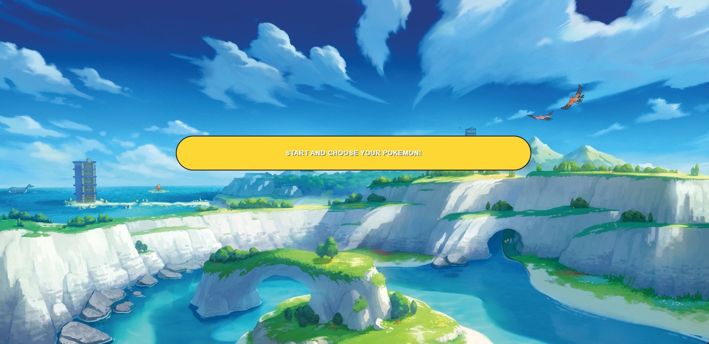
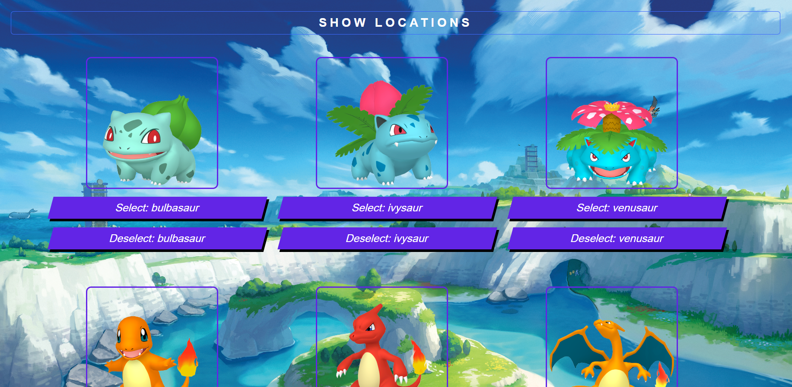
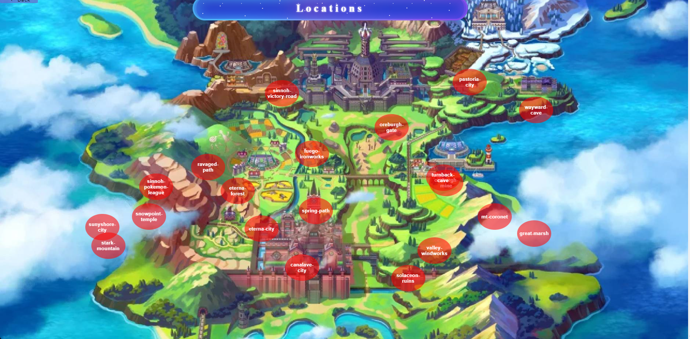

# PokemonApp

## Project Description

 Our project represents a Pokemon game. You will choose a pokemon which you can use in battle. After you have chosen your pokemon, you can go to a certain location on the map. On each location on the map, you'll encounter a pokemon which you have to defeat in order to gain experience.

If you press on the "Start" button you will see a list of pokemons.

After you select a pokemon, by pressing the "Show Locations" button you will see a map of all the locations.

If you select a location the battle will start.

### Technologies Used

We utilized the following technologies:

- **Express.js**: Backend development, creating APIs.
- **React**: Dynamic UI components.
- **Bootstrap**: Responsive styling.
- **CSS**: Custom styling.

### Challenges

Challenges faced during development:

- Finding a suitable pokemon API which contained all the information we need.
- Designing the battle scene to make it look as realistic as possible.

### Future Plans

Our plans for the future:

- Adding a health bar and more animations for the battle.
- Adding special powers and different battle scenes depending on the pokemon.
- Create a 3D battle.

## Setup

### Frontend Setup:

1. **Prerequisites:**

   - Ensure Node.js is installed and properly configured.

2. **Install Dependencies:**

   - Navigate to the `frontend` directory.
   - Run: `npm install` or `pnpm install`.

3. **Run the Frontend:**

   - Run: `npm run dev`.
   - Click the provided link to open the Pokemon game.

## Code Contributors
- Denisa Cuta: [GitHub Profile](https://github.com/ced15)
- Ionut Dima: [GitHub Profile](https://github.com/Ionut2707)